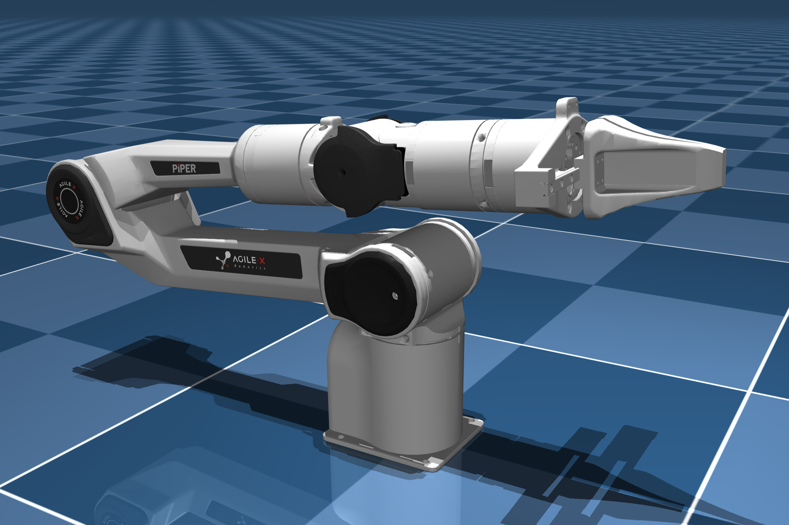
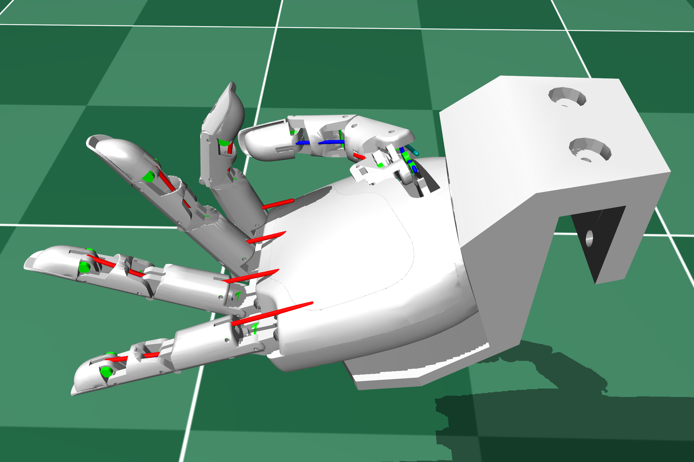
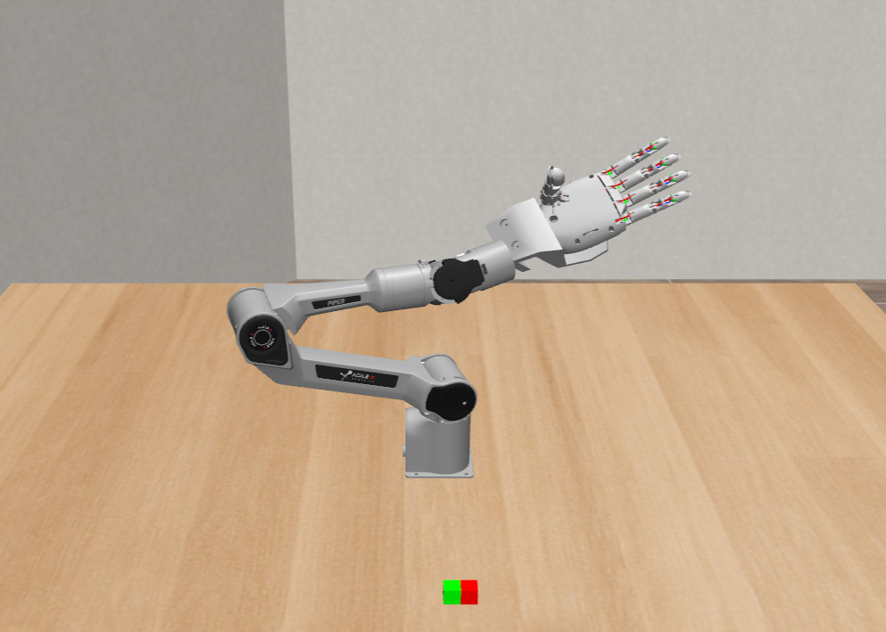
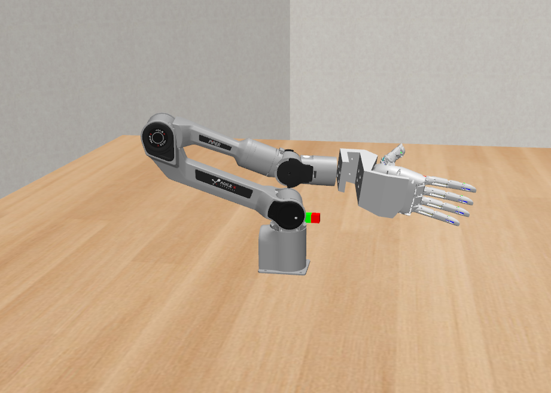
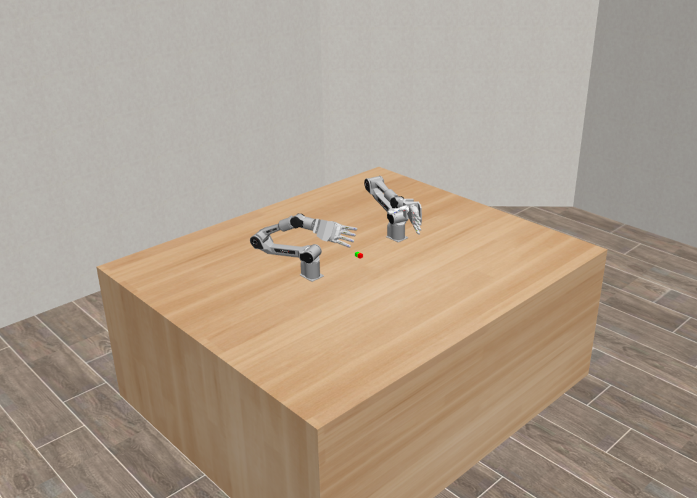
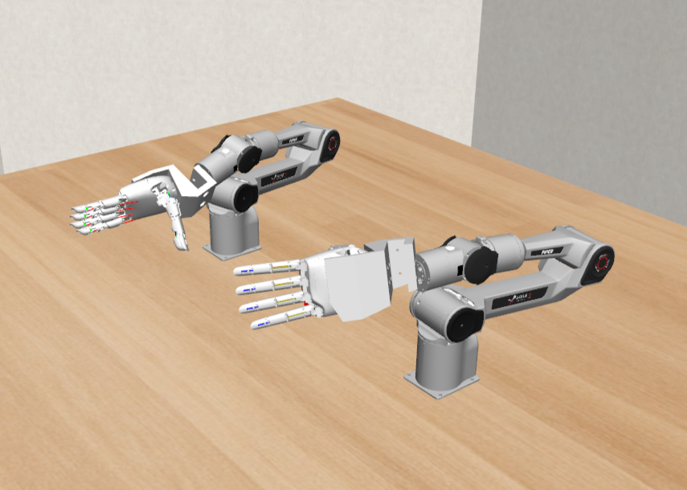

# AeroPiper: TetherIA Aero Hand + AgileX PiPER Arm

<p align="center">
  
</p>

## Images

<p align="center">
  
  
  <br/>
</p>

### Description
This repository provides end-to-end code and guidance to integrate the TetherIA Aero Hand with the AgileX PiPER 6‑DOF robotic arm. AeroPiper lets you:
- Initialize and exercise the physical arm and hand with one command.
- Run MuJoCo simulations of left, right, or dual arm+hand configurations.
- Prototype gesture sequences and arm trajectories with clear, well-structured examples.

Use this as a practical, open resource for research, education, and rapid prototyping with PiPER + Aero in both real and simulated environments.

### Official resources
- **TetherIA Aero Hand Open Docs**: `https://docs.tetheria.ai`
- **AgileX PiPER product page**: `https://global.agilex.ai/products/piper`
- **MuJoCo documentation**: `https://mujoco.readthedocs.io`

## Folder Structure
Below is the high-level layout (images directory omitted):

```text
.
├── aero_piper/
│   ├── aero_piper_left.xml
│   ├── aero_piper_right.xml
│   ├── scene_left.xml
│   ├── scene_right.xml
│   ├── scene_dual.xml
│   └── combined_arm_hand/
│       └── assets/            # STL/OBJ meshes for the arm and hands
├── scripts/
│   ├── robot_connection.py
│   ├── reach_task.py
│   ├── left_aero_piper_control.py
│   ├── right_aero_piper_control.py
│   └── dual_aero_control.py
├── arm_hand_control_dual.py
└── README.md
```

Brief descriptions:
- `aero_piper/`: MuJoCo scenes and resources for single and dual setups.
  - `scene_left.xml`, `scene_right.xml`, `scene_dual.xml`: ready-to-run scenes.
  - `aero_piper_left.xml`, `aero_piper_right.xml`: component models used by scenes.
  - `combined_arm_hand/assets/`: 3D meshes for the PiPER arm and Aero hands.
- `scripts/`:
  - `robot_connection.py`: one-click bring-up; configures CAN and serial, initializes both devices; exposes helpers.
  - `reach_task.py`: simple physical demo (approach, grasp, lift, home) using helpers.
  - `left_aero_piper_control.py`, `right_aero_piper_control.py`: single-arm+hand simulation runners.
  - `dual_aero_control.py`: dual-arm+hand simulation runner.
- `arm_hand_control_dual.py`: standalone dual simulation utility that builds left/right variants and launches a dual viewer.

## Installation
- **Python**: 3.13.5
- **NumPy**: 1.26.4
- **MuJoCo**: 3.3.7

Install required packages:

```bash
pip install piper_sdk
pip install aero-open-sdk
pip install mujoco
```

## Work with the Physical Robot
After connecting the Aero Hand to the PiPER arm using the 3D printed mount, plug in both devices and run:

```bash
python scripts/robot_connection.py
python scripts/reach_task.py
```

The scripts will automatically:
- Setup CAN interface for PiPER arm (requires sudo, will prompt for password)
- Fix serial port permissions for Aero Hand (requires sudo, will prompt for password)
- Initialize both devices
- Run test movements

This takes ~3 minutes and calibrates the hand to its zero positions.

## Work in the MuJoCo Simulation

<p align="center">
  
  
</p>

### Left hand
```bash
python scripts/left_aero_piper_control.py
```
Uses `aero_piper/scene_left.xml` and runs a reproducible random arm trajectory with a smooth gesture sequence.

### Right hand
```bash
python scripts/right_aero_piper_control.py
```
Uses `aero_piper/scene_right.xml` with the same control pattern.

## Use both hands with two arms

<p align="center">
  
  
  <br/>
</p>

Run the dual-arm+dual-hand simulation:

```bash
python scripts/dual_aero_control.py
```

This uses `aero_piper/scene_dual.xml`, driving two independent 6‑DOF arms and two 7‑DOF tendon-driven hands with staggered gesture cycles.
